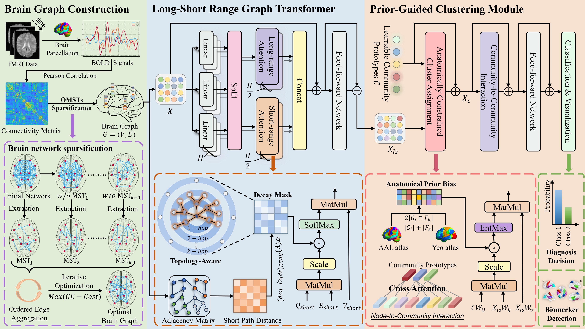

# BrainHGT: A Hierarchical Graph Transformer for Interpretable Brain Network Analysis
The official Pytorch implementation of paper "BrainHGT: A Hierarchical Graph Transformer for Interpretable Brain Network Analysis".

## Abstract

Graph Transformer shows remarkable potential in brain network analysis due to its ability to model graph structures and complex node relationships. Most existing methods typically model the brain as a flat network, ignoring its modular structure, and their attention mechanisms treat all brain region connections equally, ignoring distance-related node connection patterns. However, brain information processing is a hierarchical process that involves local and long-range interactions between brain regions, interactions between regions and sub-functional modules, and interactions among functional modules themselves. This hierarchical interaction mechanism enables the brain to efficiently integrate local computations and global information flow, supporting the execution of complex cognitive functions. To address this issue, we propose BrainHGT, a hierarchical Graph Transformer that simulates the brain’s natural information processing from local regions to global communities. Specifically, we design a novel long-short range attention encoder that utilizes parallel pathways to handle dense local interactions and sparse long-range connections, thereby effectively alleviating the over-globalizing issue. To further capture the brain’s modular architecture, we designe a prior-guided clustering module that utilizes a cross-attention mechanism to group brain regions into functional communities and leverage neuroanatomical prior to guide the clustering process, thereby improving the biological plausibility and interpretability. Experimental results indicate that our proposed method significantly improves performance of disease identification, and can reliably capture the sub-functional modules of the brain, demonstrating its interpretability.
## Overall Pipeline



The workflow starts with brain graph construction using the Orthogonal Minimal Spanning Trees (OMSTs) algorithm to create a sparse, efficient brain network. This graph is then processed by a long-short range graph Transformer to capture multi-scale features of the brain regions. Finally, a prior-guided clustering module aggregates these features into biologically plausible functional communities, allowing the model to learn from these hierarchical interactions to perform classification.
## Usage

1. Update *path* in the file *source/conf/dataset/ABIDE.yaml* to the path of your dataset.

2. The model requires a pre-computed Dice similarity matrix as an anatomical prior. This matrix measures the spatial overlap between the ROIs in your dataset and a standard functional atlas, such as the Yeo 7-network atlas (Yeo et al. J Neurophysiol. 2011).
- Generate the Matrix: Create the Dice matrix and save it as a *.csv* file(e.g., as *DICE_CPAC200_&_Yeo-7-liberal_res-1x1x1.csv*). For detailed generation methods, refer to Lawrence et al., "Standardizing human brain parcellations," Sci Data (2021).
- Update Configuration: Change the *dice_path* attribute in the file *source/conf/model/BrainHGT.yaml* to the path of your generated prior matrix.

3. Run the following command to train the model.

```bash
python -m source --multirun datasz=100p model=BrainHGT dataset=ABIDE repeat_time=10 preprocess=non_mixup
```
- **datasz**, default=(10p, 20p, 30p, 40p, 50p, 60p, 70p, 80p, 90p, 100p). Percentage of the total number of samples in the dataset to use for training.

- **model**, default=(BrainHGT). Model to be used. The model configuration to use (from conf/model/).

- **dataset**, default=(ABIDE). The dataset configuration to use (must have a corresponding file in conf/dataset/)

- **repeat_time**, default=10. The number of times to repeat the experiment with different random seeds.

- **preprocess**, default=(mixup, non_mixup). Data pre-processing.

## Dependencies

  - python=3.9
  - cudatoolkit=11.3
  - torchvision=0.13.1
  - pytorch=1.12.1
  - torchaudio=0.12.1
  - wandb=0.13.1
  - scikit-learn=1.5.0
  - pandas=2.3.1
  - hydra-core=1.2.0
  - numpy=1.26.4

